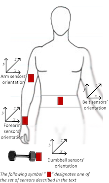

```{r setup, include=FALSE}
knitr::opts_chunk$set(echo = TRUE,tidy = TRUE,fig.width=4,fig.align = "center",warning = FALSE)
```
## Course Project, Practical Machine Learning
 
### Summary: 
#### Predicting incorrect, as well as correct, weight lifting
We built a classification model trained on data from accelerometers on a weight and the belt, arm and forearm (***Figure 1***, below) of six human subjects to predict whether they executed 10 repetitions of a simple Unilateral Dumbbell Biceps Curl exercise correctly, or not. See the Weight Lifting Exercises Dataset collected by the [Human Activity Recognition project (HAR)][1] at the Catholic University of Rio de Janeiro (Brazil).  

We predicted six responses, [labeled A through E][2], a correct lift (A) and five different incorrect lifts: throwing elbows forward (B), lifting only halfway (C), lowering only halfway( D), and throwing hips forward (E).  

Since we predicted those responses without any subject matter expertise to select plausible causal features, we built four alternative models that select features automatically. Then, we assessed their **Out of Sample Error** with cross-validation on a training subset and their Accuracy in predicting a separate validation subset. No model stacking was necessary.

Finally, we made predictions on a very small testing set with the most accurate model, cross-validated *Random Forest*. Its Accuracy was only slightly higher than a much faster *Support Vector Machines* model and a slightly faster *Generalized Boosted-regression Model*. Each of those three were much more accurate than a *Linear Discriminant Analysis* model.
 
***Fig. 1***, Location of Accelerometers: 
 
```{r message=FALSE}
library(plyr)
library(dplyr)
library(caret)
library(kernlab)
library(randomForest)
library(ggplot2)
library(ggthemes)
options(digits = 3,max.print = 200)
```
 
#### Getting the Dataset
We used a version of the original dataset already split into a very large `training` set (N=19622) and a very small `testing` set (N=20) for the *Practical Machine Learning* course. They contained 160 features. 
```{r cache=TRUE,message=FALSE}
urlTrain<-"https://d396qusza40orc.cloudfront.net/predmachlearn/pml-training.csv"
urlTest<-"https://d396qusza40orc.cloudfront.net/predmachlearn/pml-testing.csv"
download.file(urlTrain,destfile="./data/pml-training.csv", method="curl")
download.file(urlTest,destfile ="./data/pml-testing.csv", method = "curl")
training = read.csv("./data/pml-training.csv", na.strings=c('', 'NA'))
testing = read.csv("./data/pml-testing.csv", na.strings=c('', 'NA'))
dim(training);dim(testing)
```
 
### Data Preparation 
#### 1. too many NAs in most features
Visual inspection of the dataset summary (not included here) immediately revealed one major problem: 19,216 of the 19,622 records contained only `NA` or `#DIV/0!` for 100 of the 160 features rendering them useless for prediction. Here are the counts of features with 0 or 19,216 `NAs`, the only combinations in the entire dataset:
```{r}
trainingIsNA<-is.na.data.frame(training)
table(apply(trainingIsNA,2,sum))
```

```{r}
trainingAnyNAs<-apply(training,2,anyNA)
table(trainingAnyNAs)
```

So, the first data cleaning step was simply to drop all 100 features containing mostly `NA` and `#DIV/0!`, leaving 60 features and 19,622 complete records.
```{r}
trainingNoNAs<-training[,trainingAnyNAs==FALSE]
dim(trainingNoNAs)
```

A second feature selection step was to drop seven non-numeric features that had no predictive value leaving a slimmed-down `training` set with only 53 features.
```{r}
trainingCleanVars<-trainingNoNAs[,-c(1:7)]
dim(trainingCleanVars)
```
While the reduction in features might sound a bit drastic, those remaining covered readings of all three dimensions (`x`, `y` and `z`) from all four accelerometers (`dumbell`, `belt`, `arm` and `forearm`), as well as the `classe` response, a non-numeric factor.
```{r}
names(trainingCleanVars)
```
 
We double-checked that the same number of incomplete features... 
```{r}
testingNoNAs<-testing[,trainingAnyNAs==FALSE]
dim(testingNoNAs)
```
...and non-numeric features were dropped from the much smaller `testing` dataset, as well.
```{r}
testingCleanVars<-testingNoNAs[,-c(1:7)]
dim(testingCleanVars)
```
 
Finally, we confirmed that none of the retained features suffered from non-zero variance.
```{r} 
NearZeroClean<-nzv(trainingCleanVars,saveMetrics=TRUE)
sum(NearZeroClean$nzv)
```
 
### Split off extra validation subset 
#### (for assessing model Accuracy): 
Taking advantage of the `training` set's large size, we subsetted it into still large `train` (N=14718) and `valid` (N=4904) subsets for model building and assessment, respectively, as well as features-only (52) and response-only (1) alternatives for convenience.
```{r cache=TRUE}
set.seed(34567)
inTrain<-createDataPartition(trainingCleanVars$classe,p=0.75,list=FALSE)
trainCleanVars<-trainingCleanVars[inTrain,]
validCleanVars<-trainingCleanVars[-inTrain,]
trainFeatures<-as.matrix(trainCleanVars[,-53])
trainResponse<-as.factor(trainCleanVars[,53])
validFeatures<-validCleanVars[,-53];validResponse<-validCleanVars[,53]
dim(trainFeatures); str(trainResponse)
```
```{r}
dim(validFeatures); str(validResponse)
```
We confirmed that the resulting distribution of `classe` responses was similar for the two subsets:
```{r}
table(trainResponse)
```
```{r}
table(validResponse)
```

### Cross Validation & Normalization 
#### Cross Validation to measure Out of Sample Error 
We set up **10-fold Cross Validation**---without repetition in order to conserve runtime) for the *Linear Discriminant Analysis* model and *Generalized Boosted-regression Model* executed in  `caret`, leaving that to be set up directly in non-`caret` calls that built the *Support Vector Machines* and *Random Forest* models. (The choice of whether to build each type of model in `caret`, or not, was based on runtime.)
```{r}
ctrl<-trainControl(method = "cv", number = 10)
```
 
#### Scale and Center all features
Since the 52 features were all numeric or integer, we decided to scale and center them in each of the separate model algorithm calls below. While not strictly necessary for the *Generalized Boosted-regression Model* and *Random Forest* tree-generating models, this normalization was required for *Support Vector Machines* and would help for *Linear Discriminant Analysis*, too. 
 
### Four alternative models with Cross Validation
#### 1. Linear Discriminant Analysis (LDA)
**Out of Sample Error** for the *LDA* model built with `caret` was 1 - the `0.701` Accuracy, a disappointing 29.1%. Runtime was short, just 1:00 minute.
```{r message=FALSE,cache=TRUE}
set.seed(34567)
fitLda<-train(classe ~ .,data=trainCleanVars, method="lda", 
              preProc = c("center","scale"), trControl=ctrl)
fitLda
```
The *LDA* model got fully 1,421 predictions wrong. So, its Confusion Matrix exhibited lots of error, both Type I false positives and Type II false negatives.
```{r}
predictLda<-predict(fitLda,validFeatures)
confusionMatrix(predictLda,validResponse)$table
```
```{r}
table(predictLda==validResponse)
confusionMatrix(predictLda,validResponse)$overall[1]
```
 
#### 2. Generalized Boosted-regression Modeling (GBM) trees 
**Out of Sample Error** for the *GBM* model built with `caret` was dramatically lower at 1 - `0.961`, or 3.9%, for the automatically-chosen tuning parameters of `n.trees` = `150` and `interactiondepth` = `3`. *GBM*  got only 189 predictions wrong with slightly more Type I false positives than Type II false negatives. Runtime, though, was much longer, approx. 16:00 minutes.
 
```{r message=FALSE,cache=TRUE}
set.seed(34567)
fitGbm<-train(classe ~ ., data = trainCleanVars, method="gbm", 
              preProc = c("scale","center"), trControl = ctrl, verbose = FALSE)
fitGbm
predictGbm<-predict(fitGbm,validCleanVars)
confusionMatrix(predictGbm,validCleanVars$classe)$table
```
```{r}
table(predictGbm==validCleanVars$classe)
confusionMatrix(predictGbm,validCleanVars$classe)$overall[1]
```
 
***Figure 2*** plots *SVM* model Accuracy by Boosting Iterations while tuning the Maximum Tree Depth parameter to `1`, `2` & `3`, which makes clear why `caret` set it to `3`.
```{r fig.width=5}
plot(fitGbm,main="Fig. 2: Tuning the Maximum Tree Depth parameter",ylab="Accuracy",
     xlab="Boosting Iterations")
```

#### 3. Support Vector Machines (SVM)
The *SVM* model, built with `ksvm` using the Radial Basis Function kernel in the `kernlab` package, scaled and centered all features by default, but **10-fold Cross Validation** had to be chosen manually by setting the `cross` option to 10.  

**Out of Sample Error**, reported below as `Cross validation error`, was also impressively low at 1.8%, not much higher than the `Training error` of 1.2%. *SVM* got only 67 predictions wrong, mostly Type I false positives. Runtime was fast, too, approx. 2:00 minutes. 
 
```{r message=FALSE,cache=TRUE}
set.seed(34567)
fitSVMrbf <- ksvm(classe ~ ., data = trainCleanVars, kernel = "rbfdot",
                  scaled = TRUE, C = 16, cross = 10)
fitSVMrbf
predictSVMrbf<-predict(fitSVMrbf,validCleanVars)
confusionMatrix(predictSVMrbf,validCleanVars$classe)$table
```
```{r}
table(predictSVMrbf==validCleanVars$classe)
confusionMatrix(predictSVMrbf,validCleanVars$classe)$overall[1]
```
  
#### 4. Random Forest (RF) bagged trees
##### Two Error rates: Out of Bag & Cross Validation
The **Out of Sample Error** of 0.9% for the *RF* model built with `randomForest` was the lowest of all. We tuned the `mtry` parameter to 13, as explained below, and therefore read the corresponding **Out of Sample Error** on the table line for 13 "variables" (i.e., randomly selected for consideration at each split). *RF* got only 17 (out of 4,904) predictions for the `valid` subset wrong, very few of either Type I or II.

Random Forest is not as prone to over-fitting as other algorithms; so, it may not require cross validation on its own (see [StackExchange, "Does modeling with Random Forests requre cross-validation?"][3]. Since it bags a large number of trees generated randomly by resampling with replacement, it reported `OOB estimate of error rate: 0.58%` is not, however, completely comparable to the **Out of Sample Error** rates reported, so far. "OOB" is Out Of Bag but not **10-fold Cross Validation**, for which the additional, slow call to `rfcv`, mentioned above, was required.  This extra **Cross Validation** step is the only reason *RF* runtime ended up being the slowest of all, approx. 25:00 minutes combined. 
```{r message=FALSE,cache=TRUE}
set.seed(34567)
fitRandomFcv500<-rfcv(trainFeatures, trainResponse, cv.fold = 10)
str(fitRandomFcv500)
```
```{r}
names(fitRandomFcv500)
```
```{r}
error<-as.numeric(fitRandomFcv500$error.cv);variables<-as.numeric(fitRandomFcv500$n.var)
errorRates500<-data.frame(cbind(variables,error))
errorRates500
```
***Figure 3*** shows that **Out of Sample Error** does not drop much more beyond `n.var` = `13` variables at each tree split. 
```{r fig.width=5}
ggplot(errorRates500)+aes(variables,error)+geom_point(color="blue2")+theme_few()+
        geom_step(color="blue2",alpha=0.5)+scale_x_continuous(breaks=c(1,3,6,13,26,52))+
        labs(y = "Out of Sample Error",x = "Variables at each split", 
        title = "Fig. 3: Tuning Random Forest's mtry parameter:",
        subtitle = "OOB Error drops quickly until mtry reaches 13")
```
 
Based on that preliminary **Cross Validation** step, we decided to manually tune the *RF* model's `mtry` parameter to `13`. Without needing to execute  **Cross Validation** again, it then ran very quickly, approx. 1:00 minute.
```{r message=FALSE,cache=TRUE}
set.seed(34567)
fitRandomF<-randomForest(classe ~ ., trainCleanVars, mtry = 13)
fitRandomF
```
Although `randomForest` defaulted to growing 500 trees, ***Figure 4*** suggests that no more than 100 would be necessary to keep Out of Bag Error low, which might make deployment of an even faster model possible (but that's beyond the scope of this report).
```{r fig.width=5}
OOBerrors<-data.frame(fitRandomF$err.rate)
ggplot(OOBerrors)+aes(row(OOBerrors)[,1],OOBerrors[,1])+geom_line(color="red2")+theme_few()+labs(title="Fig. 4: Out of Bag Error Rate drops as Forest grows",y="OOB Error",x="Trees")
```

```{r}
predictRf<-predict(fitRandomF,validFeatures) 
confusionMatrix(predictRf,validResponse)$table
```

```{r}
table(predictRf==validResponse)
confusionMatrix(predictRf,validResponse)$overall[1]
```
 

### Final Predictions
```{r cahce=TRUE}
predictFinalLda<-predict(fitLda,testingCleanVars)
predictFinalGbm<-predict(fitGbm,testingCleanVars)
predictFinalSVM<-predict(fitSVMrbf,testingCleanVars)
predictFinalRF<-predict(fitRandomF,testingCleanVars)
```
Since the `classe` response feature was withheld from our small `testing` set, we settled for an hint indicator of potential success, instead---the encouraging fact that the top three models agreed completely. Only *LDA* disagreed, making 7 different predictions, presumably false, which was enough to eliminate it from further consideration.
```{r}
PredictionAgreement<-c(sum(predictFinalLda==predictFinalGbm),sum(predictFinalGbm==predictFinalSVM),sum(predictFinalSVM==predictFinalRF))
ModelPairs<-c("LDA vs GBM","GBM vs SVM","SVM vs RF")
data.frame(cbind(ModelPairs,PredictionAgreement))
```
 
#### Ranking models by Accuracy
Although the top three models were nearly indistinguishable, the table below ranks them---by **Out of Sample** `modelAccuracy` on the large `valid` subset, not just **cross validation** on the `train` subset---in this order: *RF* > *SVM* > *GBM* >> *LDA*. 
```{r}
modelAccuracy<-c(RF=confusionMatrix(predictRf,validResponse)$overall[1],
                 SVM=confusionMatrix(predictSVMrbf,validCleanVars$classe)$overall[1],
                 GBM=confusionMatrix(predictGbm,validCleanVars$classe)$overall[1],
                 LDA=confusionMatrix(predictLda,validResponse)$overall[1])
data.frame(modelAccuracy,row.names = c("RF","SVM","GBM","LDA"))
```

### Conclusion: 
Only *LDA* appeared to have failed to predict all 20 testing values. Of the remaining three models, *SVM* had the fastest runtime, but *RF* was most accurate by a very slim margin with *GBM* the also-ran on both dimensions. We opted for highest Accuracy over shortest runtime, choosing to make the final predictions with the *Random Forest* model despite its manual tuning, separate **Cross Validation**, and relative slowness. The final response values (from A through E) predicted by the doubly **Cross Validated** *RF* model were: 
```{r}
as.matrix(predictFinalRF)
```
 
NOTE: wordcount < 1,500

[1]: http://groupware.les.inf.puc-rio.br/har
[2]: http://groupware.les.inf.puc-rio.br/har#weight_lifting_exercises
[3]: https://datascience.stackexchange.com/questions/6510/does-modeling-with-random-forests-requre-cross-validation